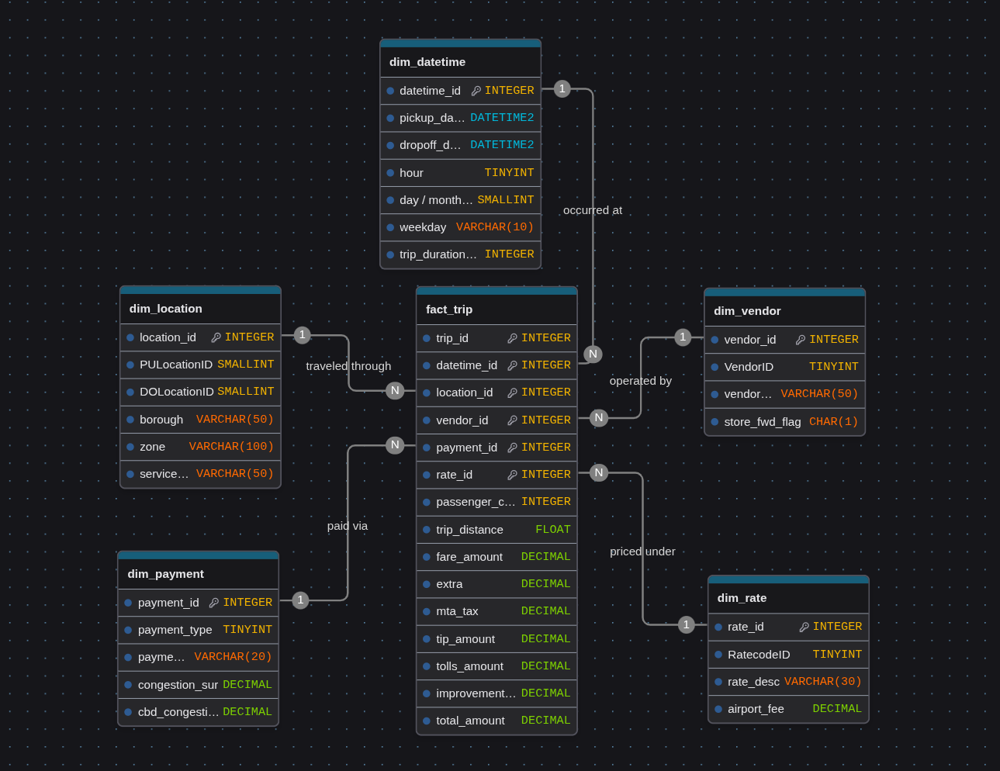
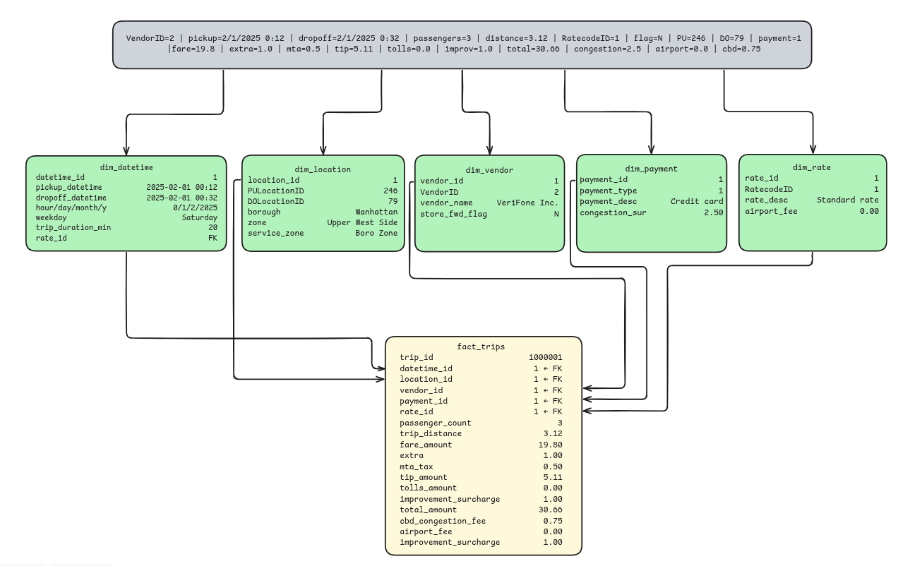

# Data Warehouse 
## Design

We use a classic star schema: one central `FACT_TRIP` table with numeric measures, surrounded by five dimensions. Raw TLC trip data is very relational, so this layout keeps it clean while making it easy for the analysis team to slice by time, neighborhood, vendor, payment method, or rate without huge joins.



The mapping below shows how raw attributes land in the fact table vs. the dimensions. This is the practical view we follow in the Spark transforms.

**FACT_TRIP metrics:**
```pyhton
- passenger_count
- trip_distance
- fare_amount
- extra
- mta_tax
- tip_amount
- tolls_amount
- improvement_surcharge
- total_amount
```

**Dimensions:**
```python
- DIM_DATETIME: pickup/dropoff timestamps plus derived fields (hour, day, month, weekday) and `trip_duration_min` for time-based analysis.
- DIM_LOCATION: maps each location id to borough, zone, and service zone so trips can be grouped by neighborhood.
- DIM_VENDOR: identifies the provider and whether the trip was stored and forwarded.
- DIM_PAYMENT: payment method plus congestion-related fees for clean payment breakdowns.
- DIM_RATE: rate code context (standard, JFK, etc.) and any airport fee.
```
And here's the data will look like:

