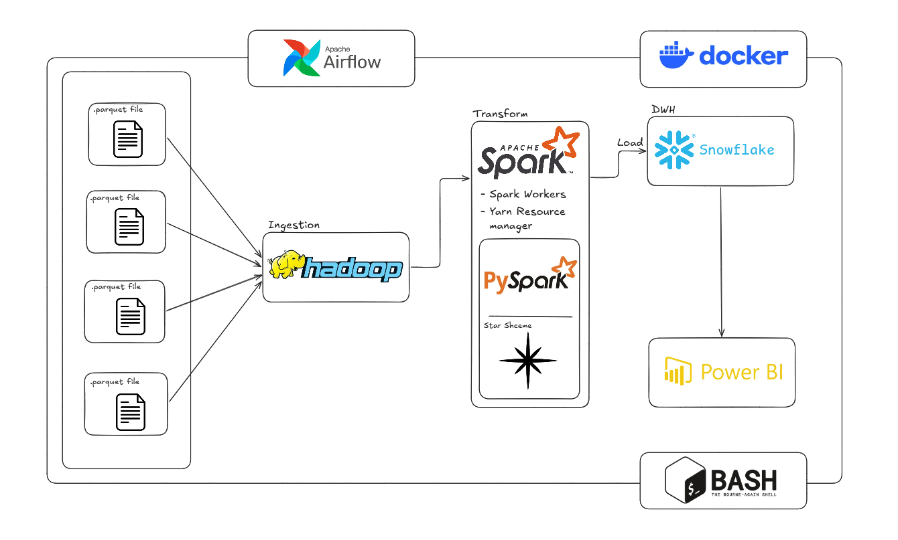
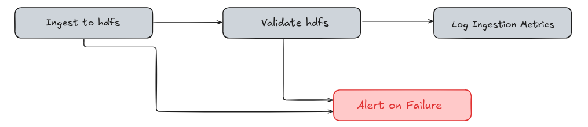
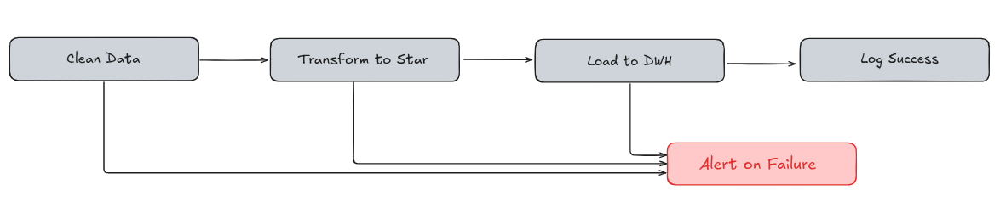
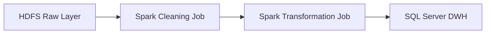
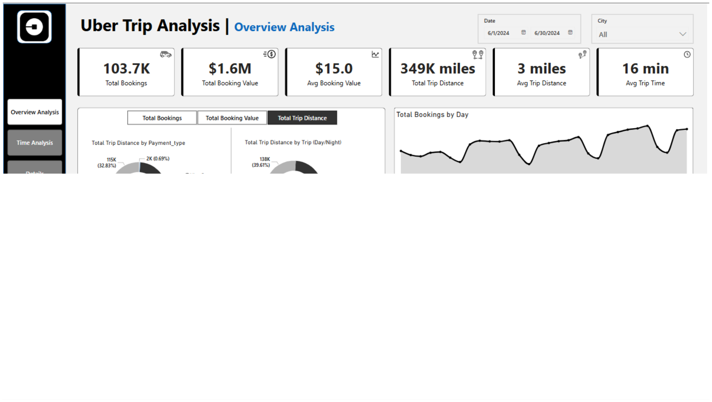

# NYC Uber ETL Pipeline


An end-to-end, containerized ETL pipeline for NYC TLC taxi trip Parquet data that ingests raw files into HDFS on a schedule, validates the landing zone, and provides a Spark-based transformation layer designed to load curated (star-schema) tables into a SQL data warehouse.



Core stack: 
```python
- Docker Compose,
- Apache Airflow (orchestration),
- Hadoop HDFS (raw layer), 
- Apache Spark (clean/transform), 
- Snowflake (DWH), 
- PostgreSQL (Airflow metadata), 
- Python/Bash, and Jupyter (EDA).
```

## Project Structure

```txt
.
├── airflow/
│   └── dags/
│       └── ingestion_dag.py          # Airflow DAG: ingest -> validate -> log/alert
├── data/                             # Local Parquet drop-zone (bind-mounted into containers)
├── hadoop/
│   ├── config/
│   │   └── hdfs_paths.env            # Shared paths/patterns for ingestion scripts
│   ├── images/
│   │   └── ingestflow.png
│   ├── scripts/
│   │   ├── ingest_to_hdfs.sh         # Upload Parquet into HDFS raw path
│   │   └── validate_hdfs.py          # Validate raw layer contents in HDFS
│   └── README.md
├── spark/
│   ├── images/
│   │   └── transformLayer.png
│   ├── jobs/                         # Spark production jobs (currently scaffolding/WIP)
│   ├── notebooks/                    # EDA + cleaning helpers (pandas + PySpark)
│   └── README.md
├── DWH/                              # Data warehouse assets (currently empty/WIP)
├── images/                           # Repo-level assets (banner, dashboard screenshots, etc.)
├── scripts/                          # Misc scripts (mounted into Airflow; currently empty)
├── docker-compose.yaml               # Local stack: Hadoop, Spark, MSSQL, Airflow + Postgres
├── .env.example                      # Environment template (copy to .env)
├── CONTRIBUTING.md
└── .gitignore
```

Key directories:
- `airflow/`: scheduling and orchestration (DAGs).
- `hadoop/`: HDFS runtime plus ingestion/validation scripts used by Airflow.
- `spark/`: transformation layer (notebooks today; `jobs/` intended for `spark-submit` workflows).
- `data/`: local file drop-zone that gets bind-mounted into Hadoop/Spark/Airflow.

## Project Details

Quickstart (local, Docker Compose):

```sh
cp .env.example .env
docker compose up -d hadoop spark-master spark-worker mssql airflow-postgres
docker compose up airflow-init
docker compose up -d airflow-webserver airflow-scheduler
```

Environment variables (high-signal):

| Variable | Source | Why it matters |
|---|---|---|
| `AIRFLOW_FERNET_KEY` | `.env` | Required for Airflow to start and manage encrypted connections/variables. |
| `AIRFLOW_SECRET_KEY` | `.env` | Webserver/session secret key. |
| `AIRFLOW_ADMIN_USER`, `AIRFLOW_ADMIN_PASSWORD`, `AIRFLOW_ADMIN_EMAIL` | `.env` | Bootstraps the admin user via `airflow-init`. |
| `POSTGRES_USER`, `POSTGRES_PASSWORD`, `POSTGRES_DB` | `.env` | Airflow metadata database (Postgres container). |
| `MSSQL_SA_PASSWORD` | `.env` | SQL Server will refuse to start if the password is not strong enough. |
| `MSSQL_JDBC_URL` | `.env` | JDBC URL passed into Airflow tasks for DWH loads. |
| `DOCKER_GID` | `.env` | Fixes permissions for `/var/run/docker.sock` mounted into Airflow. |

---
### System Overview
#### Ingestion Pipeline:
- The system monitors the `./data/` directory for NYC TLC Parquet files matching the `*_tripdata_*.parquet` pattern, orchestrating a 15-minute ingestion cycle via the `uber_ingestion_pipeline` DAG in Apache Airflow which executes `ingest_to_hdfs.sh` for HDFS raw zone transfer and `validate_hdfs.py` for data integrity verification.



#### Transformation & Loading:
- Spark Standalone cluster retrieves raw data from HDFS to perform cleaning and analytical transformations through production-ready jobs located in `spark/jobs/`, handling schema enforcement and business logic before persisting final curated datasets into the SQL Server Data Warehouse via JDBC.



**Process Flow:**


---

### Gotchas

> [!IMPORTANT]
> **Docker Socket Permissions**: 
> Airflow uses `docker exec` to communicate with the Hadoop container. 
> - Ensure the Airflow container has access to the Docker socket.
> - If you encounter a `permission denied` on `/var/run/docker.sock`, update the `DOCKER_GID` in your `.env` file as described in `docker-compose.yaml`.

> [!WARNING]
> **Database Initialization**: 
> The current `docker-compose.yaml` expects an initialization script at `./mssql/init.sql`. 
> - **Action Required**: Create the `mssql/` directory and `init.sql` file, or comment out the bind-mount in the compose file to avoid startup errors.

> [!NOTE]
> **HDFS Persistence**: 
> By default, the Hadoop base image treats HDFS as **ephemeral** (data will be lost when containers are torn down). 
> - For persistent storage configurations, please refer to [./hadoop/README.md](hadoop/README.md).

### Service UIs & Ports

| Service | UI / Access Link | Port |
| :--- | :--- | :--- |
| **Airflow UI** | [http://localhost:8082](http://localhost:8082) | `8082` |
| **Spark Master UI** | [http://localhost:8080](http://localhost:8080) | `8080` |
| **Spark Worker UI** | [http://localhost:8081](http://localhost:8081) | `8081` |
| **Spark Application UI** | [http://localhost:4040](http://localhost:4040) | `4040` |
| **HDFS NameNode UI** | [http://localhost:9870](http://localhost:9870) | `9870` |
| **YARN ResourceManager** | [http://localhost:8088](http://localhost:8088) | `8088` |
| **SQL Server** | `localhost:1433` | `1433` |

### Project Documentation

| Category | Resource | Link |
| :--- | :--- | :--- |
| **Big Data** | Hadoop Documentation | [./hadoop/README.md](hadoop/README.md) |
| **Processing** | Spark Documentation | [./spark/README.md](spark/README.md) |
| **Collaboration** | Contributing Guide | [./CONTRIBUTING.md](CONTRIBUTING.md) |

## Dashboard
