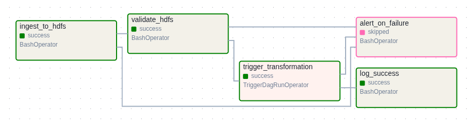
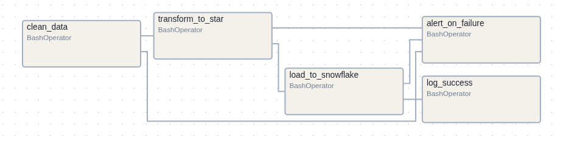

# Airflow DAG Documentation

## DAG: `uber_ingestion_pipeline`

**Purpose**: Ingests NYC TLC trip data into the HDFS raw layer on a 15‑minute cadence, validates the landing zone, then triggers the transformation DAG.

**Schedule**: `*/15 * * * *` (every 15 minutes). `catchup=False`, `max_active_runs=1`.

**Connections / External Systems**:
- **HDFS** via `ingest_to_hdfs.sh` and `validate_hdfs.py`.
- **Airflow** internal trigger to start `uber_transformation_pipeline`.

**Workflow / Graph**: `ingest_to_hdfs >> validate_hdfs >> trigger_transformation >> log_success` with `alert_on_failure` firing if any upstream task fails.

**Tasks**:

| Task ID | Operator | What it does |
| --- | --- | --- |
| `ingest_to_hdfs` | `BashOperator` | Runs `ingest_to_hdfs.sh` to move `*_tripdata_*.parquet` files into HDFS raw paths for the current execution timestamp. |
| `validate_hdfs` | `BashOperator` | Runs `validate_hdfs.py` to confirm the expected data landed in HDFS. |
| `trigger_transformation` | `TriggerDagRunOperator` | Starts the `uber_transformation_pipeline` DAG after successful ingestion + validation. |
| `log_success` | `BashOperator` | Prints a completion banner when all upstream tasks succeed. |
| `alert_on_failure` | `BashOperator` | Prints a failure banner if any upstream task fails. |

---

## DAG: `uber_transformation_pipeline`

**Purpose**: Cleans raw data, builds the star schema tables, and loads curated data into Snowflake.

**Schedule**: `None` (triggered by `uber_ingestion_pipeline`). `catchup=False`, `max_active_runs=1`.

**Connections / External Systems**:
- **Spark** via `spark-submit` on the `spark-master` container.
- **HDFS** for intermediate CSV outputs from the transform step.
- **Snowflake** via `load_to_snowflake.py` (JDBC/driver handled by the script).

**Workflow / Graph**: `clean_data >> transform_to_star >> load_to_snowflake >> log_success` with `alert_on_failure` firing if any upstream task fails.

**Tasks**:

| Task ID | Operator | What it does |
| --- | --- | --- |
| `clean_data` | `BashOperator` | Runs the Spark `clean.py` job to standardize and clean raw trip data. |
| `transform_to_star` | `BashOperator` | Runs the Spark `transform.py` job to build dimension + fact datasets in star schema shape. |
| `load_to_snowflake` | `BashOperator` | Executes `load_to_snowflake.py` to load curated tables into Snowflake. |
| `log_success` | `BashOperator` | Prints a completion banner when all upstream tasks succeed. |
| `alert_on_failure` | `BashOperator` | Prints a failure banner if any upstream task fails. |
